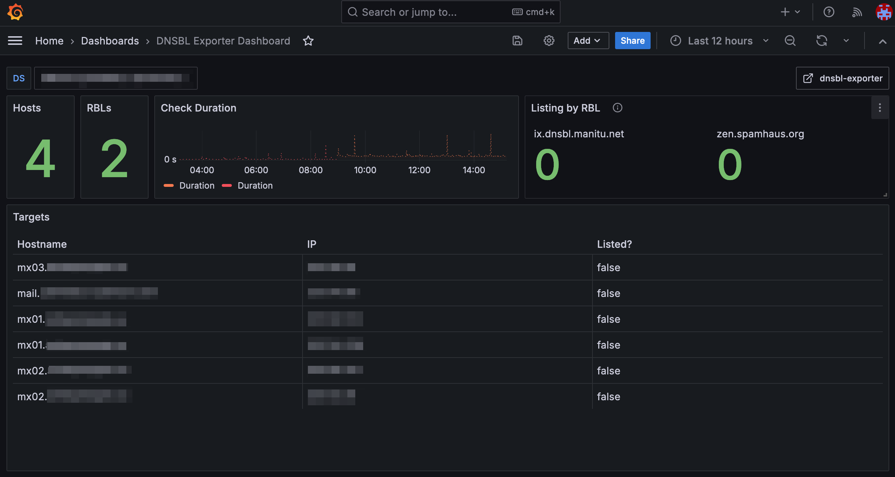

# contrib

## dashboard



Import the `database.json`. All changes/additions/feedback welcome.

## Docker Swarm

Running the exporter on Swarm is possible! Create your configs with:

```sh
docker config create targets.ini targets.ini
docker config create rbls.ini rbls.ini
```

... and use the [`docker-compose.yml`](./docker-compose.yml) to deploy the stack.

To use (Docker) Compose, use volumes instead of configs, or create your own image.
